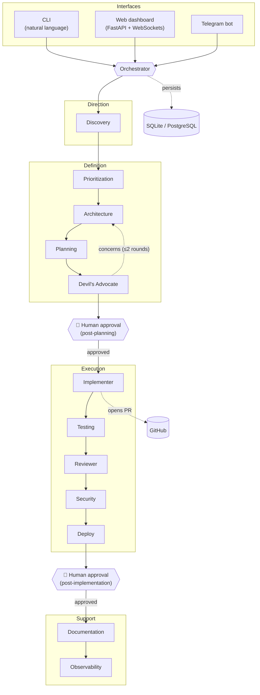

# Monarch AI

**A multi-agent orchestration platform that turns a plain-language request into shipped
software** — running a 12-agent pipeline on the [Claude API](https://docs.anthropic.com/)
with human-in-the-loop approval gates, per-agent circuit breakers, and prompt caching.

> 🇧🇷 [Versão em português](README.pt-BR.md)

[](https://www.python.org/)
[](https://docs.anthropic.com/)
[](https://fastapi.tiangolo.com/)

---

## What it does

Describe a task in natural language — from a CLI, a web dashboard, or a Telegram message —
and Monarch AI runs it through a pipeline of specialized agents that **discover** intent,
**design** and **critique** a plan, pause for your **approval**, then **implement**, **test**,
**review**, and **document** the result. Each agent is a focused Claude call with its own
system prompt, model, and failure isolation.

It also incubates and operates a portfolio of sub-projects (content automation, catalog
tooling, a PDF factory) through the same orchestration core.

## Architecture



The pipeline runs in four layers with two human checkpoints:

| Layer | Agents | Role |
|---|---|---|
| **Direction** | Discovery | Parse intent into structured requirements |
| **Definition** | Prioritization → Architecture → Planning → Devil's Advocate | Design a solution and stress-test it (the Devil's Advocate can send concerns back for up to 2 refinement rounds) |
| 🛑 **Approval gate** | — | Human approves the plan before any code is written |
| **Execution** | Implementer → Testing → Reviewer → Security → Deploy | Write code, run the test suite, review, security-audit, prepare deployment |
| 🛑 **Approval gate** | — | Human approves before merge/release |
| **Support** | Documentation → Observability | Update docs/changelog and wire up metrics |

## Key features

- **Multi-agent pipeline** — 12 specialized agents, each a separate Claude call with its own
  system prompt and responsibilities (`agents/`, orchestrated by `core/orchestrator.py`).
- **Human-in-the-loop** — two approval gates (post-planning, post-implementation) resolved via
  Telegram inline buttons or the web panel, with a configurable timeout.
- **Resilience** — a per-agent [circuit breaker](core/circuit_breaker.py) plus retry with
  exponential backoff isolates failures and prevents cascading retries.
- **Cost controls** — prompt caching (ephemeral `cache_control`) on system prompts, per-agent
  model selection across the Claude family (Opus / Sonnet / Haiku), and a **local mode** that
  routes agent calls through the Claude CLI (Pro subscription) instead of API credits.
- **Three interfaces** — a natural-language CLI, a real-time web dashboard (FastAPI +
  WebSockets), and a Telegram bot, all sharing one orchestrator and datastore.
- **GitHub integration** — optional: reads/writes files and opens branches/PRs
  (`tools/github_tools.py`), with a local-filesystem fallback when GitHub is not configured.

## Tech stack

**Language** Python 3.12+ ·
**LLM** Anthropic Claude API (`anthropic` SDK) ·
**Web** FastAPI + Uvicorn + WebSockets ·
**Bot** python-telegram-bot ·
**Data** SQLAlchemy (async) + aiosqlite / PostgreSQL ·
**Config** Pydantic Settings ·
**Tooling** pytest · ruff · mypy (strict) · bandit ·
**Packaging** Docker + docker-compose

## Getting started

### Prerequisites
- Python 3.12+
- An Anthropic API key ([console.anthropic.com](https://console.anthropic.com/))
- (Optional) a Telegram bot token and a GitHub token

### Run locally

```bash
git clone https://github.com/Ewertonslv/Monarch-IA.git
cd Monarch-IA

python -m venv .venv
source .venv/bin/activate          # Windows: .venv\Scripts\activate
pip install -e ".[dev]"

cp .env.example .env               # then fill in your keys
python main.py                     # starts the web dashboard + Telegram bot
```

Or talk to it directly from the CLI:

```bash
python -m interfaces.cli "build a landing page for a fitness coach"
```

### Run with Docker

```bash
cp .env.example .env               # fill in your keys
docker compose up --build
```

The full compose stack includes PostgreSQL, the orchestrator, the core API, and an Nginx
reverse proxy.

## Configuration

All configuration is via environment variables (loaded from `.env`). See
[`.env.example`](.env.example) for the full list. Key variables:

| Variable | Required | Description |
|---|---|---|
| `ANTHROPIC_API_KEY` | ✅ | Claude API key |
| `TELEGRAM_BOT_TOKEN` / `TELEGRAM_CHAT_ID` | ✅ | Telegram interface + approval notifications |
| `GITHUB_TOKEN` / `GITHUB_REPO` | — | Enables GitHub integration (PRs); omit for local-only mode |
| `IMPLEMENTER_MODEL` | — | Override the model used by the implementer agent |
| `LOCAL_MODE` | — | Route agent calls through the Claude CLI instead of API credits |
| `DATABASE_URL` | — | Defaults to local SQLite; set to PostgreSQL for production |

## Testing

```bash
pytest                 # run the test suite
ruff check .           # lint
mypy .                 # static type checking (strict)
bandit -r .            # security scan
```

## Project structure

```
agents/        12 pipeline agents (discovery, architecture, implementer, …)
core/          orchestrator, task model, circuit breaker
interfaces/    CLI and Telegram bot
apps/          web dashboard, core API, and incubated sub-projects
storage/       async database layer (SQLAlchemy)
tools/         GitHub and filesystem integrations
tests/         unit + integration tests
docs/          design notes and operator context
```

## License

See repository for license details.
